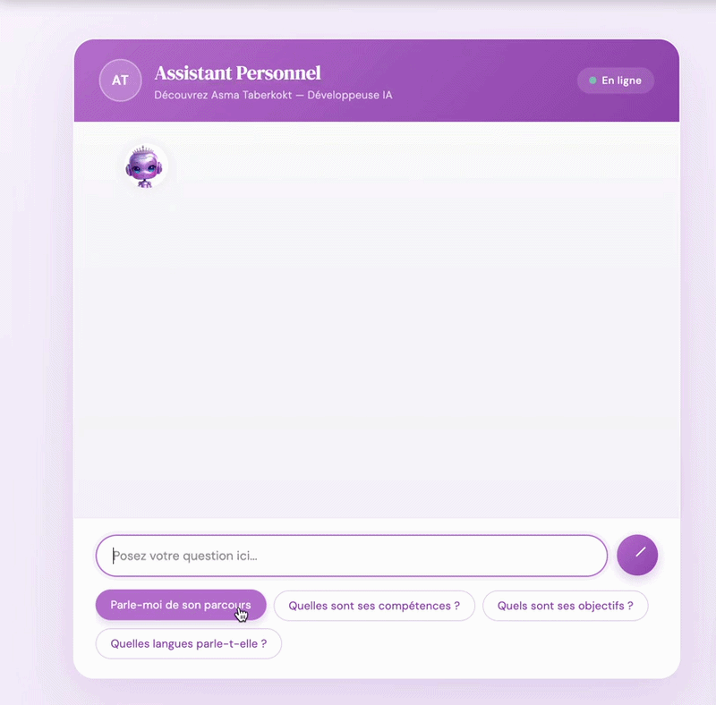

# 🤖 Chatbot RAG - Asma Taberkokt

Chatbot intelligent utilisant RAG (Retrieval-Augmented Generation) avec FastAPI, ChromaDB et Groq API.

##  Démo



##  Structure du Projet

```
chatbot/
├── frontend/          # Frontend statique (Vercel)
│   ├── index.html
│   ├── style.css
│   ├── script.js
│   └── robot.png
│
├── backend/           # Backend Python (Render)
│   ├── app.py
│   ├── requirements.txt
│   ├── Dockerfile
│   ├── render.yaml
│   ├── data.txt
│   └── RENDER_DEPLOYMENT.md
│
└── README.md
```

##  Déploiement

### Frontend (Vercel)
1. Connectez le dossier `frontend/` à Vercel
2. Vercel détectera automatiquement la configuration via `vercel.json`
3. Le site sera déployé en ~30 secondes

### Backend (Render)
1. Connectez le dossier `backend/` à Render
2. Render utilisera `render.yaml` et `Dockerfile`
3. Le backend sera déployé en ~10-15 minutes

##  URLs

- **Frontend** : https://votre-site.vercel.app
- **Backend** : https://asma-rag-chatbot-2.onrender.com

##  Documentation

- Frontend : Voir `vercel.json`
- Backend : Voir `backend/render.yaml` et `backend/Dockerfile`

##  Technologies

- **Frontend** : HTML, CSS, JavaScript
- **Backend** : FastAPI, ChromaDB, Groq API, Docker
- **Hosting** : Vercel (frontend) + Render (backend)